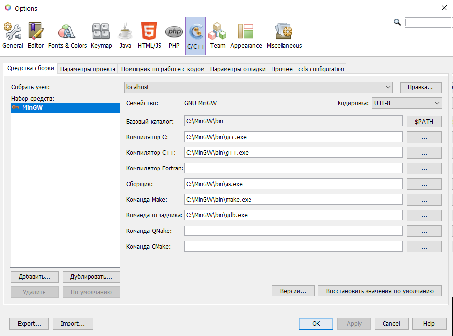

# NetBeans_wxWidgets_Div2_demo(windows)
Пример визуальной программы с wxWidgets на C++ в Apache NetBeans с использованием wxFormBuilder для Windows



   
```
C:/wxWidgets/lib/gcc_lib/mswu;C:/wxWidgets/include
-pipe -mthreads -D__GNUWIN32__ -D__WXMSW__ -DwxUSE_UNICODE -Wall -O2 -IC:\wxWidgets\include -IC:\wxWidgets\lib\gcc_lib\mswu
```


```
C:/wxWidgets/lib/gcc_lib
-LC:\wxWidgets\lib\gcc_lib -s -mthreads -lwxmsw31u_core -lwxbase31u -lwxpng -lwxjpeg -lwxtiff -lwxzlib -lwxregexu -lkernel32 -luser32 -lgdi32 -lwinspool -lcomdlg32 -ladvapi32 -lshell32 -lole32 -loleaut32 -luuid -lcomctl32 -lwsock32 -lodbc32 -lshlwapi -lversion -loleacc -luxtheme
```
msys64: https://nav.dl.sourceforge.net/project/msys2/Base/x86_64/msys2-x86_64-20200903.exe
MinGW, wxWidgets, wxFormBuilder: https://github.com/tsnsoft/CodeLite_wxWidgets_wxFB
